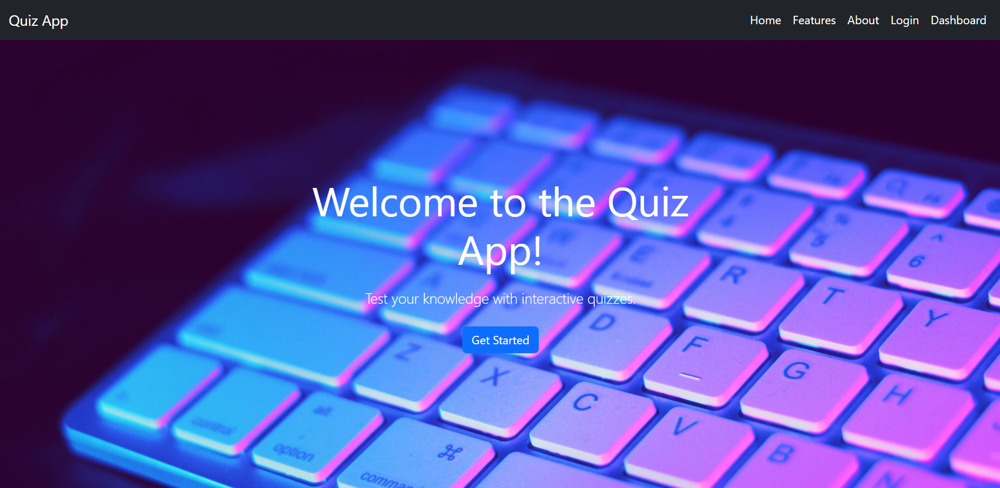

# Quiz-App

## Introduction
An engaging platform for testing knowledge across various topics,
with interactive quizzes, real-time feedback, and a dynamic, enjoyable
learning experience

## Project Screenshot


### Author(s) LinkedIn:
<p>
    <a href="https://www.linkedin.com/in/natnael-seifu/">LinkedIn Profile</a>
</p>

## Developer
<p>
    <strong>Natnael Seifu</strong><br>
    Contact: <a href="mailto:natiseifu02@gmail.com.com">natiseiuf02@gmail.com</a>
</p>

## Table of Contents
- [Overview](#overview)
- [Features](#features)
- [Technologies Used](#technologies-used)
- [Installation](#installation)
- [Usage](#usage)
- [Documentation](#documentation)


## Overview
**Quiz App** is an interactive web-based application designed to help users test their knowledge with multiple-choice questions. Users can answer questions, track their scores, and see their performance in different quiz categories.

## Features
- User authentication (registration and login)
- REST API (CRUD) for quizzes
- Unit tests ensure functionality, reliability, and performance
- Dynamic quiz selection based on categories
- Instant feedback on performance
- Scoring system and result display
- Detailed dashboard results
- User leaderboards
- Responsive design for mobile and desktop


## Technologies Used
- **Backend**: Python, Flask
- **Frontend**: HTML, CSS, Bootstrap
- **Database**: SQLite
- **Version Control**: Git

## Installation
To set up the project locally, follow these steps:

1. **Clone the repository:**
   ```bash
   git clone https://github.com/naty1914/quiz-app.git
   cd quiz-app
   ```
2. ** Create a virtual environment:**
   ```bash
   python3 -m venv venv
   source venv/bin/activate
   ```
3. **Install dependencies:**
   ```bash
   pip install -r requirements.txt
   ```
4. **Set up environment variables: Create a .env file in the  app directory and add the following:**
   ```bash
   DATABASE_URL=sqlite:///your_database.db
   SECRET_KEY=your_secret_key
   ```
5. **Ensure the virtual environment is activated (if not already activated):**
   ```bash
   source venv/bin/activate
   ```
6. ** Initialize  the database:**
   ```bash
   flask db init
   flask db migrate
   flask db upgrade
   ```
7. **Run the application:**
   ```bash
   flask run
   ```

## Usage
- **Signup and Login**: Users can register for an account or log in to access the quizzes.
- **Quiz Categories**: Select a quiz category to test your knowledge.
- **Instant Feedback**: Receive immediate feedback on your answers.
- **Dashboard**: Track your performance and view detailed results.


## Documentation
- [Flask Documentation](https://flask.palletsprojects.com/en/2.2.x/)

## Contribution
Contributions are welcome! If you'd like to contribute to this project, please follow these steps:

1. **Fork the repository**.
2. **Create a new branch** for your feature or bug fix:
   ```bash
   git checkout -b feature/YourFeature
   ```
3. **Make your changes and commit them** :
   ```bash
   git commit -m "Add your message here"


4. **Push your changes to the remote repository**:
   ```bash
   git push origin feature/YourFeature
   ```

5. **Create a pull request with a description of your changes** .


# Website
Check out the live application:  [here](https://quiz-app-3jwf.onrender.com/)
